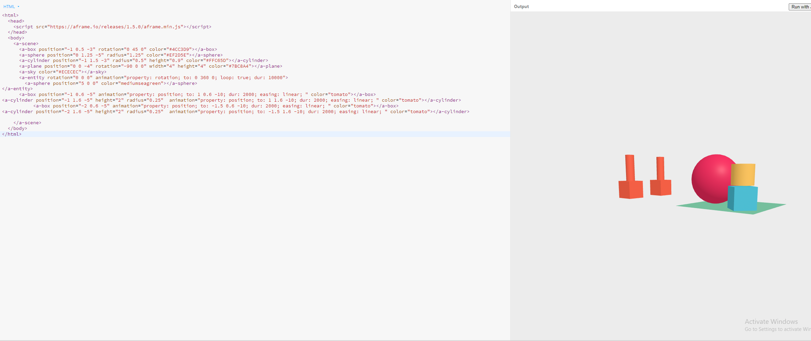
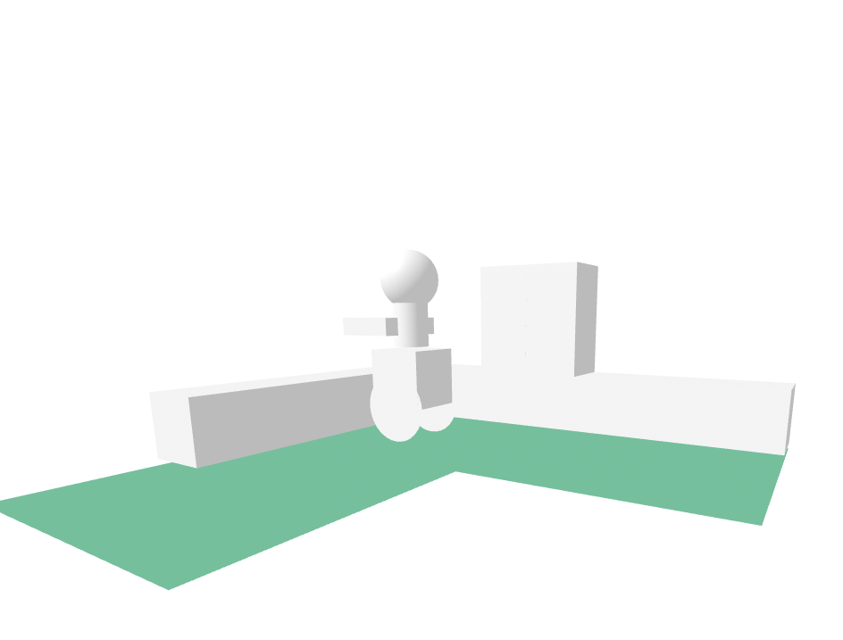
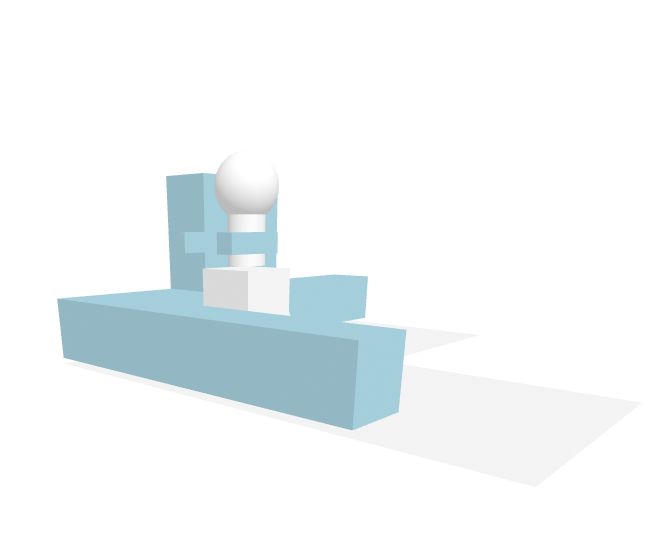

# Entry 5
##### 4/8/24

## Content 

Everyone had to pick a tool to use and as I said before I picked Aframe. Lately we have been learning how to use our tools and write Learning logs about them. There are many codes and ways I tinkered with Aframe as you can see in the bottom. I learn how to make 3D models with Aframe, how to make them move and many others. I learned these by watching videos and using their website, then tinkered with everything. 

#### How I tinkered with Aframe

Learning COMPONENTS

anchored:
````
<a-entity id="myBox" anchored="persistent: true" geometry="primitive: box" material="color: red"></a-entity>
````

animation: changes/moves shapes and stuff

````
<a-box position="-1 1.6 -5" animation="property: position; to: 1 8 -10; dur: 2000; easing: linear; loop: true" color="tomato"></a-box>
````

````
<a-entity rotation="0 0 0" animation="property: rotation; to: 0 360 0; loop: true; dur: 10000">
        <a-sphere position="5 0 0" color="mediumseagreen"></a-sphere>
</a-entity>
````
fog:
````
<a-scene fog="type: linear; color: #AAA"></a-scene>
````

hand-controls:
````
<a-entity id="leftHand" hand-controls="hand: left; handModelStyle: lowPoly; color: #ffcccc"></a-entity>
<a-entity id="rightHand" hand-controls="hand: right; handModelStyle: lowPoly; color: #ffcccc"></a-entity>
````

hand-tracking-controls:
````
<a-entity id="leftHand" hand-tracking-controls="hand: left;"></a-entity>
<a-entity id="rightHand" hand-tracking-controls="hand: right;"></a-entity>
````


hand-tracking-grab-controls: 
````
<a-entity id="leftHand" hand-tracking-grab-controls="hand: left;"></a-entity>
<a-entity id="rightHand" hand-tracking-grab-controls="hand: right;"></a-entity>
````

These codes are to interact with everything.

laser-controls:
````
<a-entity laser-controls="hand: left"></a-entity>
````
real-world-meshing:
````
<a-scene real-world-meshing></a-scene>
````


````
<html>
  <head>
    <script src="https://aframe.io/releases/1.5.0/aframe.min.js"></script>
  </head>
  <body>
    <a-scene>
      <a-box position="-1 0.5 -3" rotation="0 45 0" color="#4CC3D9"></a-box>
      <a-sphere position="0 1.25 -5" radius="1.25" color="#EF2D5E"></a-sphere>
      <a-cylinder position="-1 1.5 -3" radius="0.5" height="0.9" color="#FFC65D"></a-cylinder>
      <a-plane position="0 0 -4" rotation="-90 0 0" width="4" height="4" color="#7BC8A4"></a-plane>
      <a-sky color="#ECECEC"></a-sky>
      <a-entity rotation="0 0 0" animation="property: rotation; to: 0 360 0; loop: true; dur: 10000">
        <a-sphere position="5 0 0" color="mediumseagreen"></a-sphere>
</a-entity>
      <a-box position="-1 0.6 -5" animation="property: position; to: 1 0.6 -10; dur: 2000; easing: linear; " color="tomato"></a-box>
<a-cylinder position="-1 1.6 -5" height="2" radius="0.25"  animation="property: position; to: 1 1.6 -10; dur: 2000; easing: linear; " color="tomato"></a-cylinder>
      
    </a-scene>
  </body>
</html>
````


````
<html>
  <head>
    <script src="https://aframe.io/releases/1.5.0/aframe.min.js"></script>
  </head>
  <body>
    <a-scene>
      <a-box position="-1 0.5 -3" rotation="0 45 0" color="#4CC3D9"></a-box>
      <a-sphere position="0 1.25 -5" radius="1.25" color="#EF2D5E"></a-sphere>
      <a-cylinder position="-1 1.5 -3" radius="0.5" height="0.9" color="#FFC65D"></a-cylinder>
      <a-plane position="0 0 -4" rotation="-90 0 0" width="4" height="4" color="#7BC8A4"></a-plane>
      <a-sky color="#ECECEC"></a-sky>
      <a-entity rotation="0 0 0" animation="property: rotation; to: 0 360 0; loop: true; dur: 10000">
        <a-sphere position="5 0 0" color="mediumseagreen"></a-sphere>
</a-entity>
      <a-box position="-1 0.6 -5" animation="property: position; to: 1 0.6 -10; dur: 2000; easing: linear; " color="tomato"></a-box>
<a-cylinder position="-1 1.6 -5" height="2" radius="0.25"  animation="property: position; to: 1 1.6 -10; dur: 2000; easing: linear; " color="tomato"></a-cylinder>
           <a-box position="-2 0.6 -5" animation="property: position; to: -1.5 0.6 -10; dur: 2000; easing: linear; " color="tomato"></a-box>
<a-cylinder position="-2 1.6 -5" height="2" radius="0.25"  animation="property: position; to: -1.5 1.6 -10; dur: 2000; easing: linear; " color="tomato"></a-cylinder>
      
    </a-scene>
  </body>
</html>
````


````

<html>
  <head>
    <script src="https://aframe.io/releases/1.5.0/aframe.min.js"></script>
  </head>
  <body>
    <a-scene>
      <a-box position="-1 0.5 -3.5" rotation="0 90 0" color="fff" animation="property: position; to: -4 0.5 -3.5;"></a-box>
      <a-entity geometry="primitive: circle; radius: 0.6" material="side: double" position="-1 0 -4" animation="property: position; to: -4 0 -4;"></a-entity>
      <a-entity geometry="primitive: circle; radius: 0.6" material="side: double" position="-1 0 -3" animation="property: position; to: -4 0 -3;" ></a-entity>
      <a-cylinder position="-1 1.5 -3.5" radius="0.3" height="0.9" color="#fff" animation="property: position; to: -4 1.5 -3.5;"></a-cylinder>
      <a-sphere position="-1 2.2 -3.5" radius="0.5" color="#fff" animation="property: position; to: -4 2.2 -3.5;"></a-sphere>
      <a-box position="-1.5 1.4 -3" rotation="0 90 0" color="lightblue" width="0.3" height="0.3" animation="property: position; to: -4.5 1.4 -3;"></a-box>
      <a-box position="-1.5 1.4 -4" rotation="0 90 0" color="lightblue" width="0.3" height="0.3" animation="property: position; to: -4.5 1.4 -4;"></a-box>
            <a-plane position="0 -0.6 -4" rotation="-90 0 0" width="4" height="4" color="#fff"></a-plane>
            <a-plane position="-4 -0.6 -4" rotation="-90 0 0" width="4" height="4" color="#fff"></a-plane>
            <a-plane position="-4 -0.6 0" rotation="-90 0 0" width="4" height="4" color="#fff"></a-plane>
       <a-box position="-5.5 0 -3" width="6" rotation="0 90 0" color="lightblue"></a-box>     
            <a-box position="-2 0 -5.5" width= "8" rotation="0 0 0" color="lightblue"></a-box>
                  <a-box position="-2 1 -5.5" rotation="0 0 0" color="lightblue"></a-box>
                  <a-box position="-3 1 -5.5" rotation="0 0 0" color="lightblue"></a-box>
                  <a-box position="-2 2 -5.5" rotation="0 0 0" color="lightblue"></a-box>
                  <a-box position="-3 2 -5.5" rotation="0 0 0" color="lightblue"></a-box>
    </a-scene>
  </body>
</html>
````






All of these are me trying out A frame and changing codes and combining codes I learned.
## Sources
I mostly use two sources which are ["Aframe youtube"](https://www.youtube.com/watch?v=K4LEMBjaV9E&list=PL8MkBHej75fJD-HveDzm4xKrciC5VfYuV&index=6) and the ["Aframe website"](https://aframe.io/docs/1.5.0/introduction/javascript-events-dom-apis.html). The ["Aframe website"](https://aframe.io/docs/1.5.0/introduction/javascript-events-dom-apis.html) tells me what the codes is and what it does. I was able to look and reserch on the website to find the codes I needed and I start to tinker with the codes that the website gives me. Later if I don't understand the website I use ["Aframe youtube"](https://www.youtube.com/watch?v=K4LEMBjaV9E&list=PL8MkBHej75fJD-HveDzm4xKrciC5VfYuV&index=6) which on youtube I am able to see what the codes does and I can copy the code. After copying the code I can tinker with it like that. Also I used ["Aframe youtube"](https://www.youtube.com/watch?v=K4LEMBjaV9E&list=PL8MkBHej75fJD-HveDzm4xKrciC5VfYuV&index=6) to teach me how to combined different codes together to make my 3D model move. So these are the sources I used and how I used them. 


## Skills 
Some skills I learned while learning my tool was how to tinker, do research on my tool and communicate with others that are doing the same tool as me. 

How to tinker: tinkering is a really important part of learning a tool, you should be brave and try new stuff is what I learned when watching the edpuzzles, to tinker you want to try new codes and change the code, this was a really important skill that will later help me learn new stuff. If I didn't tinker with stuff I wouldn't understand how the codes work. But since I did I learned the codes and my tool this is why tinkering was an important skill I learned. 

How to research: I didn't know anything about my tool, so I had to research it. It was important, i had to find sources I can use to understand how to use Aframe, due to researching hard and finding good sources I was able to understand my code and tool better so researching is a really important skill thatI have developed. 

How to communicate:Lastly, when I really don't understand something, I ask my friends for help. For example, when I didn't understand how to add 3D models, Joe helped me. Also, when I didn't understand the code, my friends like Keith explained it to me. Which is my communication is another skill that I learned and will use more later on. Since communication is really helpful especially when you don't know something.

These are the skills that I learned or improved more on. Which I will use more later on. 


[Previous](entry02.md) | [Next](entry04.md)

[Home](../README.md)


